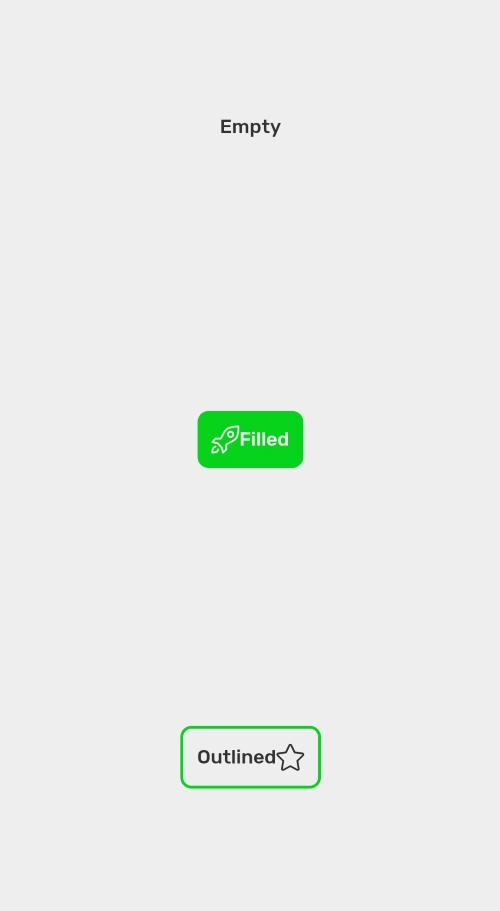

## Button

Button is component that interact with user



```
import React from 'react';
import { Container, Button } from 'react-native-simple';
import { StyleSheet } from 'react-native';
import { SimpleLineIcons } from '@expo/vector-icons';

export default () => {
  return (
    <Container
      style={{
        alignItems: 'center',
        justifyContent: 'space-around',
      }}
    >
      <Button title="Empty" />
      <Button
        startIcon={
          <SimpleLineIcons name="rocket" style={styles.startIcon} />
        }
        title="Filled"
        variant="filled"
      />
      <Button
        title="Outlined"
        variant="outlined"
        endIcon={
          <SimpleLineIcons name="star" style={styles.endIcon} />
        }
      />
    </Container>
  );
};
```

## Props

### `title`

Label of the button
| Type | Default |
| ------------------------------------------- | ---------- |
| `string` | |

### `buttonColor`

Main color of the `Button`

| Type                                        | Default    |
| ------------------------------------------- | ---------- |
| [`SimpleBackgroundColor`](customization.md) | `"accent"` |

### `variant`

Style variant of the button

| Type                                             | Default   |
| ------------------------------------------------ | --------- |
| [`empty`,`filled`, `outlined`](customization.md) | `"empty"` |

### `onPress`

Callback that when button is pressed

| Type       | Default     |
| ---------- | ----------- |
| `()=>void` | `"primary"` |

### `style`

Style of the button container
| Type | Default |
| ------------------------------------------- | ---------- |
|`StyleProps<ViewStyle>` | |

### `labelStyle`

Style of the button's label
| Type | Default |
| ------------------------------------------- | ---------- |
|`StyleProps<TextStyle>` | |

### `startIcon`

Component on the left side of the button

| Type      | Default |
| --------- | ------- |
| ReactNode |         |

### `endIcon`

Component on the right side of the button

| Type      | Default |
| --------- | ------- |
| ReactNode |         |

### `shadow`

Shadow of the button

| Type                               | Default     |
| ---------------------------------- | ----------- |
| [`SimpleShadow`](customization.md) | `"primary"` |

### `enabled`

Turn on/off button
| Type | Default |
| ---------------------------------- | ----------- |
| `boolean` | `true` |

## Examples
