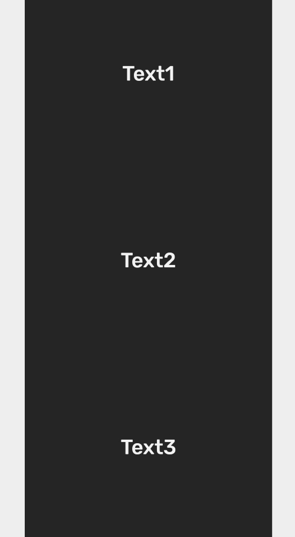

## Column

Column component fill avalaible height and display child components in column.



```
import React from 'react';
import { Text, Column } from 'react-native-simple';
import { View } from 'react-native';

export default () => {
  return (
    <View style={{ flex: 1, justifyContent: 'center' }}>
      <Column
        backgroundColor="#252525"
        align="center"
        justifyContent="space-around"
        style={{ width: 300, alignItems: 'center' }}
      >
        <Text color="secondary" fontSize="medium">
          Text1
        </Text>
        <Text color="secondary" fontSize="medium">
          Text2
        </Text>
        <Text color="secondary" fontSize="medium">
          Text3
        </Text>
      </Column>
    </View>
  );
};
```

## Props

### `backgroundColor`

Background color that can be selected from theme by name or pass color as string

| Type                                        | Default     |
| ------------------------------------------- | ----------- |
| [`SimpleBackgroundColor`](customization.md) | `'primary'` |

### `style`

Style of the `Column`

| Type                   | Default |
| ---------------------- | ------- |
| `StyleProp<ViewStyle>` |         |

### `height`

Height of the `Column`

| Type                 | Default |
| -------------------- | ------- |
| `string` or `number` | `100%`  |

### `justifyContent`

| Type   | Default |
| ------ | ------- |
| string |         |

### `align`

Self alignment of the `Column`

| Type   | Default        |
| ------ | -------------- |
| string | `'flex-start'` |

### `children`

Children of the `Column`

| Type        | Default |
| ----------- | ------- |
| `ReactNode` |         |

## Examples
