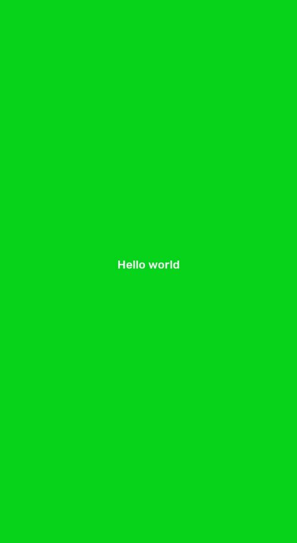

## Container

Container component fill whole screen. It's the most basic layout element.



```js
import React from 'react';
import { Container, Text } from 'react-native-simple';

const MyComponent = () => {
    return (
        <Container
            backgroundColor="accent"
            style={{ justifyContent: 'center', alignItems: 'center' }}
        >
            <Text color="secondary">Hello world</Text>
        </Container>
    );
};
```

## Props

### `backgroundColor`

Background color that can be selecte from theme by name or pass color as string

| Type                                                              | Default     |
| ----------------------------------------------------------------- | ----------- |
| [`SimpleBackgroundColor`](customization.md#simplebackgroundcolor) | `"primary"` |

### `style`

Style properties for Container

| Type                   | Default |
| ---------------------- | ------- |
| `StyleProp<ViewStyle>` |         |

### `children`

Style properties for Container

| Type        | Default |
| ----------- | ------- |
| `ReactNode` |         |

## Examples
