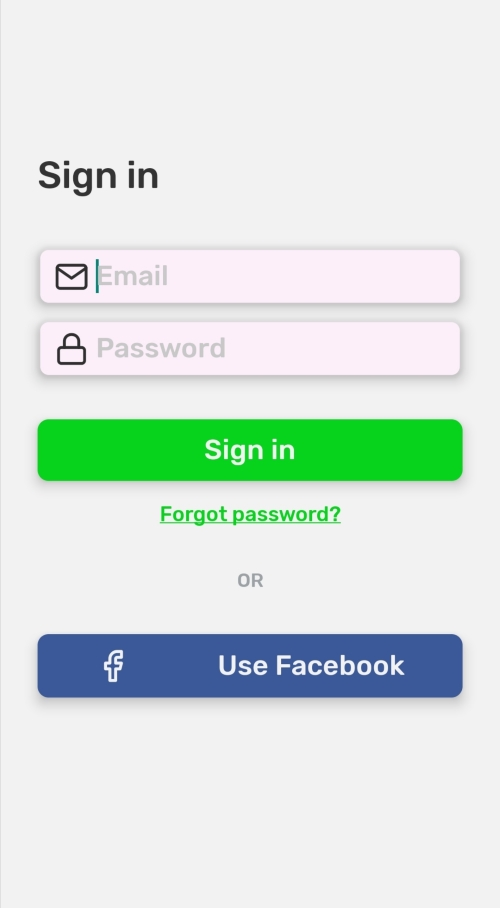

## Sign in



```tsx
//App.tsx

import React from 'react';
import { ThemeProvider } from 'react-native-simple';
import SignIn from './SignIn';

export default () => {
    return (
        <ThemeProvider
            darkMode={false}
            theme={{ typography: { primaryFont: 'Rubik_500Medium' } }}
        >
            <SignIn />
        </ThemeProvider>
    );
};
```

```js
//SignIn.tsx

import React from 'react';
import {
    StyleSheet,
    View,
    Platform,
    StatusBar,
    Dimensions,
} from 'react-native';
import { Feather } from '@expo/vector-icons';

import { Container, useTheme, Input, Text, Button } from 'react-native-simple';

const STATUS_BAR_HEIGHT = Platform.OS === 'ios' ? 20 : StatusBar.currentHeight;
const SCREEN_HEIGHT = Dimensions.get('screen').height;

export default () => {
    const {
        currentPalette,
        typography: { fontSize },
    } = useTheme();
    const { text } = currentPalette;
    const buttonLabelStyle = {
        fontSize: fontSize.normal,
        color: text.secondary,
    };
    const inputIconStyle = {
        ...styles.icon,
        backgroundColor: currentPalette.primary,
    };
    return (
        <Container style={styles.container}>
            <View style={styles.form}>
                <Text fontSize="big" style={styles.title}>
                    Sign in
                </Text>
                <Input
                    startIcon={<Feather name="mail" style={inputIconStyle} />}
                    placeholder="Email"
                    shadow="default"
                    backgroundColor="primary"
                    containerStyle={styles.input}
                />
                <Input
                    startIcon={<Feather name="lock" style={styles.icon} />}
                    placeholder="Password"
                    shadow="default"
                    backgroundColor="primary"
                    containerStyle={styles.input}
                    secureTextEntry
                />
                <Button
                    labelStyle={buttonLabelStyle}
                    shadow="default"
                    title="Sign in"
                    variant="filled"
                    style={styles.button}
                />

                <Text
                    color={currentPalette.accent}
                    fontSize="small"
                    style={styles.lnk}
                >
                    Forgot password?
                </Text>

                <Text style={styles.or} color={currentPalette.disabled.primary}>
                    OR
                </Text>

                <Button
                    labelStyle={buttonLabelStyle}
                    style={styles.facebokButton}
                    shadow="default"
                    startIcon={
                        <Feather
                            name="facebook"
                            style={{
                                ...styles.facebookIcon,
                                color: currentPalette.text.secondary,
                            }}
                        />
                    }
                    title="Use Facebook"
                    variant="filled"
                />
            </View>
        </Container>
    );
};

const styles = StyleSheet.create({
    container: {
        paddingTop: STATUS_BAR_HEIGHT + SCREEN_HEIGHT * 0.15,
        alignItems: 'center',
    },
    title: {
        marginBottom: 25,
    },
    input: {
        borderRadius: 8,
        justifyContent: 'center',
        marginTop: 10,
    },
    form: {
        width: '85%',
    },
    button: {
        marginTop: 30,
    },
    lnk: {
        textDecorationLine: 'underline',
        alignSelf: 'center',
        marginTop: 15,
    },
    icon: {
        fontSize: 25,
        color: '#2f2f2f',
        marginRight: 5,
    },
    facebookIcon: {
        fontSize: 25,
    },
    or: {
        marginVertical: 30,
        alignSelf: 'center',
    },
    facebokButton: {
        backgroundColor: '#3b5998',
    },
});
```
