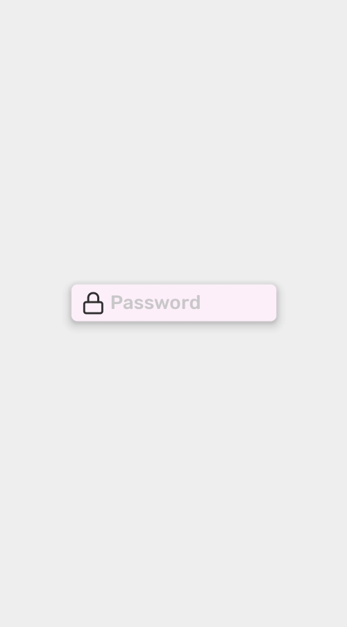

## Input

Input let user enter and edit text



```js
import React from 'react';
import { Container, Input } from 'react-native-simple';
import { StyleSheet } from 'react-native';
import { Feather } from '@expo/vector-icons';

export default () => {
    return (
        <Container style={styles.container}>
            <Input
                startIcon={<Feather name="lock" style={styles.icon} />}
                placeholder="Password"
                containerStyle={styles.input}
                backgroundColor="primary"
                color="primary"
                shadow="default"
            />
        </Container>
    );
};

const styles = StyleSheet.create({
    container: {
        justifyContent: 'center',
        alignItems: 'center',
    },
    input: {
        width: '60%',
    },
    icon: {
        fontSize: 25,
        color: '#2f2f2f',
        marginRight: 5,
    },
});
```

## Props

### `containerStyle`

Style of the `Input` container
| Type | Default |
| ------------| ------- |
| `StyleProps<ViewStyle>` | |

### `color`

Color of the text

| Type                                                  | Default     |
| ----------------------------------------------------- | ----------- |
| [`SimpleTextColor`](customization.md#simpletextcolor) | `'primary'` |

### `borderColor`

If defined border of the `Input` will show up (default width of the border is 2)

| Type                                                              | Default     |
| ----------------------------------------------------------------- | ----------- |
| [`SimpleBackgroundColor`](customization.md#simplebackgroundcolor) | `undefined` |

### `backgroundColor`

Background color of the `Input`
| Type | Default |
| --------------------- | ----------- |
| [`SimpleBackgroundColor`](customization.md#simplebackgroundcolor) | `'transparent'` |

### `shadow`

Shadow of the `Input`

| Type                                            | Default |
| ----------------------------------------------- | ------- |
| [`SimpleShadow`](customization.md#simpleshadow) |         |

### `startIcon`

Component on the left side of the `Input`

| Type        | Default |
| ----------- | ------- |
| `ReactNode` |         |

### `endIcon`

Component of the right side of the `Input`
| Type | Default |
| ------------| ------- |
| `ReactNode` | |

## Examples
