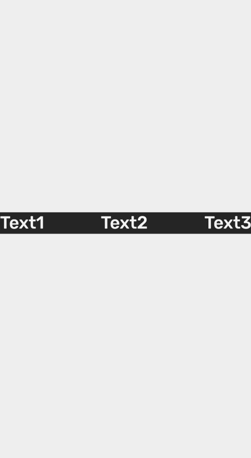

## Row

Row component fill avalaible width and display child components in row.



```js
import React from 'react';
import { Text, Row } from 'react-native-simple';
import { View } from 'react-native';

export default () => {
    return (
        <View style={{ flex: 1, justifyContent: 'center' }}>
            <Row backgroundColor="#252525" justifyContent="space-between">
                <Text color="secondary" fontSize="medium">
                    Text1
                </Text>
                <Text color="secondary" fontSize="medium">
                    Text2
                </Text>
                <Text color="secondary" fontSize="medium">
                    Text3
                </Text>
            </Row>
        </View>
    );
};
```

## Props

### `backgroundColor`

Background color that can be selected from theme by name or pass color as string

| Type                                                              | Default     |
| ----------------------------------------------------------------- | ----------- |
| [`SimpleBackgroundColor`](customization.md#simplebackgroundcolor) | `'primary'` |

### width

Width of the `Row`

| Type                 | Default |
| -------------------- | ------- |
| `string` or `number` | `100%`  |

### `style`

Style properties of the `Row`

| Type                   | Default |
| ---------------------- | ------- |
| `StyleProp<ViewStyle>` |         |

### `justifyContent`

| Type   | Default |
| ------ | ------- |
| string |         |

### `align`

Self alignment of the `Row`

| Type   | Default    |
| ------ | ---------- |
| string | `'center'` |

### `children`

Children component of the`Row`

| Type        | Default |
| ----------- | ------- |
| `ReactNode` |         |

## Examples
