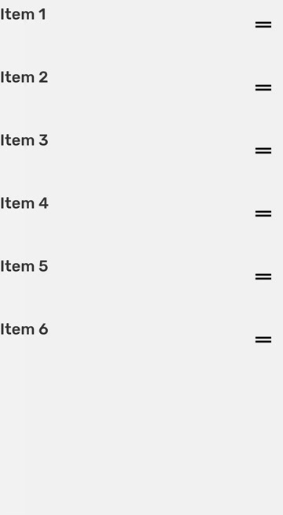

## SortableList

SortableList allow changing order in list



```tsx
import React from 'react';
import { StyleSheet, View } from 'react-native';
import { MaterialIcons } from '@expo/vector-icons';
import {
  Text,
  Container,
  SortableList,
  DraggableController,
} from 'rns';

const data = [
  {
    label: 'Item 1',
    id: '1',
  },
  {
    label: 'Item 2',
    id: '2',
  },
  {
    label: 'Item 3',
    id: '3',
  },
  {
    label: 'Item 4',
    id: '4',
  },
  {
    label: 'Item 5',
    id: '5',
  },
  {
    label: 'Item 6',
    id: '6',
  },
];

export default () => {
  return (
    <Container style={styles.container}>
      <SortableList
        itemHeight={80}
        disabled={true}
        onReorder={() => {}}
      >
        {data.map((data) => ({ gestureHandler }) => {
          return (
            <View
              style={{
                flexDirection: 'row',
                justifyContent: 'space-between',
              }}
            >
              <Text>{data.label}</Text>
              <DraggableController {...{ gestureHandler }}>
                <View style={{ padding: 10 }}>
                  <MaterialIcons name="drag-handle" size={30} />
                </View>
              </DraggableController>
            </View>
          );
        })}
      </SortableList>
    </Container>
  );
};

const styles = StyleSheet.create({
  container: {
    flex: 1,
    paddingTop: 30,
  },
  counter: {
    position: 'absolute',
    bottom: 10,
    right: 10,
  },
});

```

## Props

### `style`

Container style of the list

| Type                   | Default     |
| ---------------------- | ----------- |
| `StylProps<ViewStyle>` | `"primary"` |

### `itemHeight`

Height of signle item in the `SortableList`
| Type | Default |
| -----| --------|
| `number` | |

### `onReorder`

Function that will be called when items have reordered
| Type | Default |
| -----| --------|
| `(draggedIndex:number,swtitchedWithIndex:number)=>void` | |

### `children`

Item that will be sortable

| Type          | Default |
| ------------- | ------- |
| `ReactNode[]` |         |

## Examples
