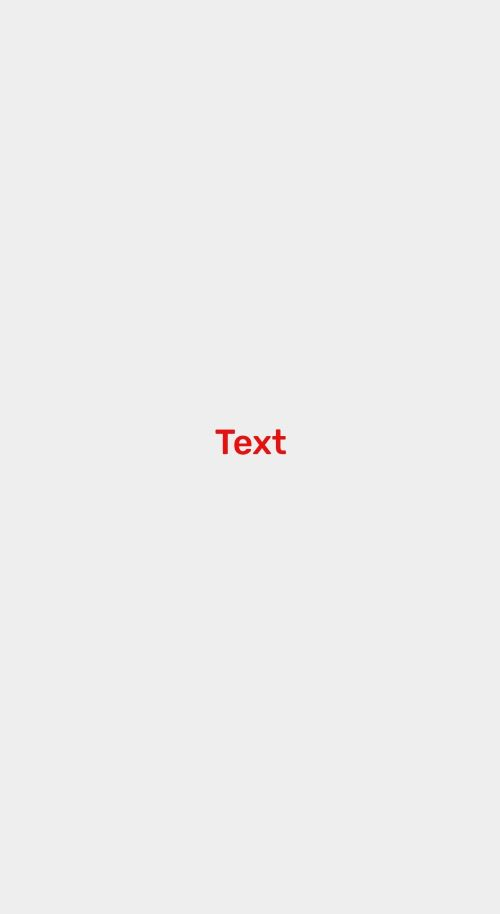

## Text

Text that allow customize with theme variables



```js
import React from 'react';
import { Text } from 'react-native-simple';
import { View } from 'react-native';

export default () => {
    return (
        <View
            style={{
                flex: 1,
                justifyContent: 'center',
                alignItems: 'center',
            }}
        >
            <Text color="#e81010" fontSize="medium">
                Text
            </Text>
        </View>
    );
};
```

## Props

### `color`

Color of the `Text`

| Type                                                  | Default     |
| ----------------------------------------------------- | ----------- |
| [`SimpleTextColor`](customization.md#simpletextcolor) | `"primary"` |

Font size of the `Text`

| Type                                                | Default    |
| --------------------------------------------------- | ---------- |
| [`SimpleFontSize`](customization.md#simplefontsize) | `"normal"` |

### `style`

Style properties of the `Text`

| Type                   | Default |
| ---------------------- | ------- |
| `StyleProp<TextStyle>` |         |

### `children`

String to display content in Text

| Type     | Default |
| -------- | ------- |
| `string` |         |

## `Examples`
